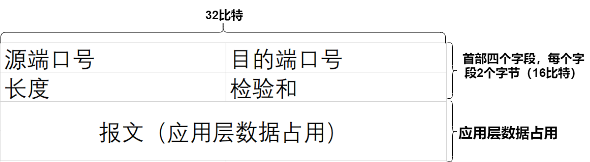
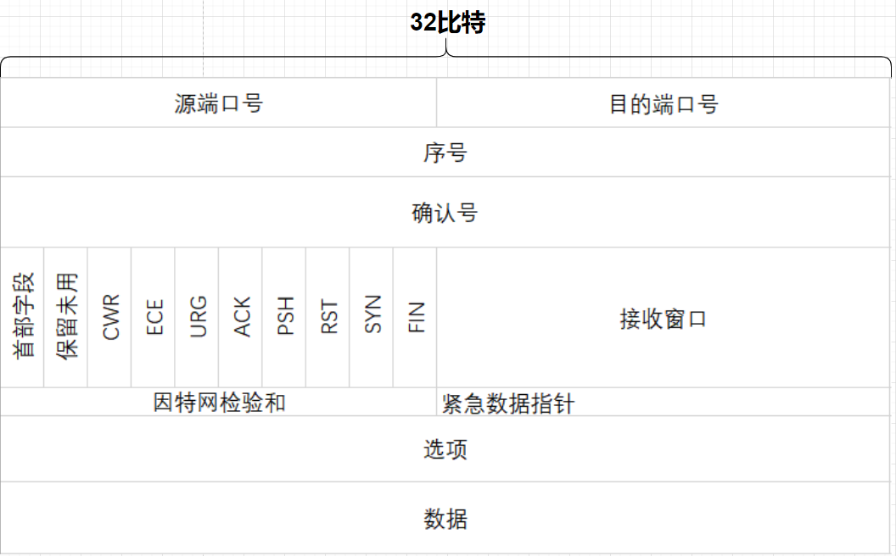
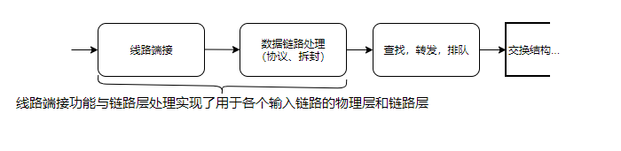
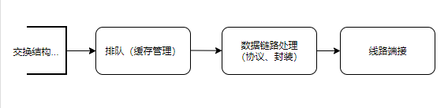

# 计算机网络 自顶向下方法

## 第一章：计算机网络与因特网

1. 每个ISP自身就是一个由多台 **分组交换机** 和 **多段通信链路** 组成的网络。 tips：ISP = Internet Service Provider

2. 因特网就是将 **端系统 彼此互联**，因此 为端系统提供接入的ISP也必须互联。

3. 低层ISP 通过 高层ISP **互联**起来，高层ISP 通过 高速光纤链路互联的高速路由器 组成。

4. 无论是 高层ISP 还是 低层ISP，每个ISP都是**独立管理**的，运行着IP协议。

5. **TCP传输控制协议 和 IP网际协议 是因特网中两个最为重要的协议**。tips：TCP是控制层协议，IP是网络层协议。

6. IP协议定义了**在路由器和端系统之间发送和接收的分组格式**。

7. 因特网的主要协议统称为 **TCP/IP**。

8. **套接字接口** **规定了**运行在一个端系统上的程序请求因特网基础设施向运行在另一个端系统上的特定目的地程序**交付数据的方式**。

9. **因特网套接字接口**是一套发送程序必须遵循的**规则集合**，因此因特网能够将数据交付给目的地。

10. 通过网络链路和交换机移动数据有两种基本方法：**电路交换**和**分组交换**。

11. 链路中的电路是通过**频分复用**(FDM)或**时分复用**(TDM)来实现的。

12. 对于FDM,链路的频谱由**跨越链路创建的所有连接共享**。

13. 在连接期间链路为**每条链接专用一个频段**。

14. 对于FDM,每条电路**连续地得到部分带宽**。

15. 对于TDM,每条电路在**短时间间隔(即间隙)中周期地得到所有带宽**。

16. 传输时延是**路由器推出分组所需要的时间**，它是**分组长度和链路传输速率的函数**，而与两台路由器之间的距离**无关**。

17. 传播时延是**一个比特从一台路由器传播到另一台路由器所需要的时间**，它是两台路由器之间**距离**的函数，而**与分组长度或链路传输速率无关**。

18. 因特网的协议栈由5个层次组成： **物理层、链路层、网络层、运输层、应用层**。

19. 应用层协议创建并部署是非常容易的。

20. 常用的因特网应用层协议：HTTP(Web文档的请求和传送)、SMTP(电子邮件报文的传送)、FTP(两个端系统之间文件传送)、DNS(域名解析系统)。

21. OSI参考模型分为七层： **应用层 表示层 会话层 运输层 网络层 链路层 物理层**。

22. 五层因特网协议栈描述：
    1、应用层：应用层是**网络应用程序及它们的应用层协议存留的地方**。

    2、运输层：因特网的运输层在**应用程序端点之间**传送**应用层报文**。

    3、网络层: 网络层负责将称为**数据报的网络层分组**从一台主机移动到另一台主机。

    4、链路层：在每一个节点，网络层将数据报下传给链路层，链路层沿着路径将数据报传递给下一个节点，在该下一个节点，链路层将数据报上传给网络层。

    5、物理层：物理层任务是将帧中的一个个比特从一个节点移动到下一个节点。

23. 在因特网中，有两种运输层协议 **TCP** 和 **UDP** ，两者都能运输应用层报文，但提供的服务不太相同（后面会说）。

24. 网络层协议 一般就是说 国际协议IP：IP仅有一个，**所有具有网络层的因特网组件必须运行IP**。

25. 链路层协议 以太网、WIFI、电缆接入网的POCSIS协议。

26. 封装：在发送主机端，一个应用层报文被传送给运输层，运输层**收取报文并附上附加信息（所谓运输层首部信息），该首部信息将被接收端的运输层使用**。同时，**应用层报文和运输层首部信息构成了运输层报文段**，这一过程可以说是运输层报文**封装**了应用层报文。随后 运输层向网络层传递封装后的运输层报文段，**网络层增加源和目的地等网络层首部信息**，这也是一层封装，生成了**网络层数据报**。网络层数据报再被传递给链路层，**链路层增加自己的链路层首部信息，并生成链路层帧**，在每一层，一个分组具有两种类型的字段：**首部字段**和**有效载荷字段**。

27. 网络接入方式分类：

    1、家庭接入：DSL、电缆、FTTH、拨号和卫星。

    2、企业和家庭接入：以太网 和 WIFI。

    3、广域无线接入： 3G 和 LTE。

28. 各层单位

**应用层报文**：一个端系统中的应用程序使用协议与另一个端系统中的应用程序交换信息的分组叫做应用层报文。

**运输层报文**：对应用层分组封装后的运输层分组就是运输层报文段。

**网络层数据报**：对运输层分组（运输层报文段）封装后的网络层分组是网络层数据报。

**链路层帧**：对网络层分组封装后的链路层分组是链路层帧。

## 第二章：应用层

1. **进程寻址**需要定义两种信息：**① 主机的地址 ② 在目的主机中指定接收进程的标识符**。

2. **IP地址**： 是一个32比特的量，并且能够**唯一地**标识该主机。

3. Web服务器用端口号80来标识，邮件服务器用端口号25来标识。

4. API 套接字：**套接字**是同一台主机内**应用层与运输层之间的接口**，由于该套接字是建立网络应用程序的可编程接口，因此**套接字也称为应用程序和网络之间的应用程序编程接口(Appliaction Programming Interface API)**。

5. 应用程序**选择运输层协议时**的服务要求分类：**①可靠数据传输 ②吞吐量 ③定时 ④安全性**

6. 因特网（更一般的是TCP/IP网络）为应用程序提供共两个运输层协议，即**UDP和TCP（都不提供加密机制）**

7. **TCP 服务模型包括面向连接服务和可靠数据传输服务**。

8. 应用层协议定义了运行在端系统上的应用程序进程如何相互传递报文。特别是应用层协议定义了：

    ①交换的**报文类型**，例如请求报文和响应报文。

    ②各种报文类型的**语法**，如报文中的各个字段及这些字段是如何描述的

    ③字段的**含义**，即这些字段中的信息的含义。

    ④确定一个进程**何时以及如何发送报文**，对报文进行相应的规则。

9. HTTP定义了**Web客户向Web服务器请求Web页面的方式，以及服务器向客户传送Web页面的方式**。

10. **HTTP使用TCP作为它的支撑运输协议**。

11. **TCP为HTTP提供可靠数据传输服务**。

12. HTTP服务器向客户**发送被请求的文件**，而**不存储**任何关于该客户的状态信息，所以说**HTTP是一个无状态协议**。

13. **HTTP既能够使用非持续连接，也能够使用持续连接**。

14. 尽管HTTP在其**默认方式下使用持续连接**，HTTP客户和服务器**也能配置成使用非持续连接**。

15. **往返时间**(Round-Trip Time,RTT)的定义：该时间是指一个短分组从客户到服务器然后再返回到客户所花费的时间，RTT包括分组传播时延，分组在中间路由器和交换机上的排队时延以及分组处理时延。

16. HTTP报文有两种：**请求报文** 和 **响应报文**。

17. HTTP请求访问的第一行叫作**请求行**，其后继行叫作 **首部行**。

18. 请求行 有三个字段：**方法字段**、**URL字段**和**HTTP版本字段**。

19. 方法字段可以取不同的值，包括**GET**、**POST**、**HEAD**、**PUT** 和 **DELETE**。

20. 首部行 Host: 如 www.baidu.com 指明了**对象所在的主机**。

21. 首部行 Connection: close 该浏览器告诉服务器**不要**麻烦的**使用持续连接**，它要求服务器在**发送完**被请求的对象后就**关闭这条连接**。

22. 首部行 User-agent: 指明**用户代理**，即**向服务器发送请求的浏览器的类型**。

23. 首部行 Accept-language: 表示用户想得到该对象的**语言版本**。

24. 网络层协议 一般就是说 国际协议IP：IP仅有一个，所有具有网络层的因特网组件必须运行IP。

25. 链路层协议 以太网、WIFI、电缆接入网的POCSIS协议。

26. 封装：在发送主机端，一个应用层报文被传送给运输层，运输层收取报文并附上附加信息（所谓运输层首部信息），该首部信息将被接收端的运输层使用。同时，应用层报文和运输层首部信息构成了运输层报文段，这一过程可以说是运输层报文封装了应用层报文。随后 运输层向网络层传递封装后的运输层报文段，网络层增加源和目的地等网络层首部信息，这也是一层封装，生成了网络层数据报。网络层数据报再被传递给链路层，链路层增加自己的链路层首部信息，并生成链路层帧，在每一层，一个分组具有两种类型的字段：首部字段和有效载荷字段。

27. 网络接入方式分类：

    1、家庭接入：DSL、电缆、FTTH、拨号和卫星。

    2、企业和家庭接入：以太网 和 WIFI。

    3、广域无线接入： 3G 和 LTE。

28. 各层单位

    应用层报文：一个端系统中的应用程序使用协议与另一个端系统中的应用程序交换信息的分组叫做应用层报文。

    运输层报文：对应用层分组封装后的运输层分组就是运输层报文段。

    网络层数据报：对运输层分组（运输层报文段）封装后的网络层分组是网络层数据报。

    链路层帧：对网络层分组封装后的链路层分组是链路层帧。

29. HTTP响应报文有三个部分： 一个初始状态行、6个首部行、实体体->主要部分。

    状态行有一行，但分为三个字段：协议版本字段、状态码和相应状态信息。

    实体体是报文的主要部分，即它包含了所请求的对象本身。

30. HTTP响应报文首部行

    Connection:close 服务器告诉客户，发送完报文后将关闭该TCP连接。

    Date:指示服务器产生并发送该响应报文的日期和时间，这个时间并不是指对象创建或最后修改的时间，而是服务器从它的文件系统中检索到该对象，将该对象插入响应报文，并发送该响应报文的时间。

    Server:指示该报文是由什么服务器产生的。类似于HTTP请求报文中的User-Agent首部行

    Last-Modified:指示了对象创建或者最后修改的日期和时间，它对既可能在本地客户也可能在网络缓存服务器上的对象缓存来说非常重要。

    Content-Length:指示了被发送对象中的字节数。

    Content-Type:指示了实体体中的对象是HTML文本。

31. 状态码：

    200 OK : 请求成功，信息在返回的响应报文中。

    301 Moved Permanently : 请求的兑现已经被永久转移了，新的URL定义在响应报文的Loaction：首部行中，客户软件将自动获取新的URL。

    400 Bad Request : 一个通用差错代码，指示该请求不能被服务器理解。

    404 Not Found : 被请求的文档不在服务器上。

    505 HTTP Version Not Supported： 服务器不支持请求报文使用的HTTP协议版本。

32. Web缓存器(Web chche)也叫代理服务器，它是能够代表初始Web服务器来满足HTTP请求的网络实体。

    Web缓存器有自己的磁盘存储空间，并在存储空间中保存最近请求过的对象的副本。

33. cookie 技术有四个组件：

    ①在HTTP响应报文中的一个cookie首部行；

    ②在HTTP亲求报文中的一个cookie首部行；

    ③在用户端系统中保留有一个cookie文件，并由用户的浏览器进行管理。

    ④位于Web站点的一个后端数据库。

34. 因特网电子邮件系统有3个主要组成部分： ①用户代理 ②邮件服务器 ③简单邮件传输协议。

35. HTTP 和 SMTP 的相同点以及区别：

    都用于从一台主机向另一台主机传送文件：

        HTTP从Web服务器向Web客户传送文件(对象)。

        SMTP从邮件服务器向另一个邮件服务器传送文件(电子邮件报文)。

    当进行文件传送时，持续的HTTP和SMTP都使用持续连接。

    区别在于：

        ①HTTP主要是一个拉协议(pull protocol)。

         SMTP是一个推协议(push protocol)。

        ②HTTP不要求报文编码格式。

         SMTP要求7比特的ASCII字符。

        ③对既包含文本又包含图形的文档处理：

            HTTP把每个对象封装到它自己的HTTP响应报文中。

            SMTP则把所有报文对象都放在一个报文中。

36. DNS 是：

    ① 一个由分层的DNS服务器(DNS server)实现的分布式数据库；

    ② 一个使得主机能够查询分布式数据库的应用层协议。

37. DNS 协议运行在UDP之上，使用53号端口。

38. DNS 提供的服务：

    ①主机名到IP地址的转换

    ②主机别名：有着复杂主机名的主机能拥有一个或者多个别名。

     应用程序可以调用DNS来获得主机别名对应的规范主机名以及主机的IP地址。

    ③右键服务器别名(mail server aliasing) 电子邮件应用程序可以调用DNS，对提供的主机名别名进行解析，以获得该主机的规范主机名及其IP地址。

    ④负载分配(load distribution)：DNS也用于在冗余的服务器之间进行负载分配。

39. DNS工作机理概述：

    用户主机 要将主机名转换为IP地址 -> 调用DNS客户端，并指明需要被转换的主机名。

    主机上的DNS收到后 -> 向网络发送一个DNS查询报文 -> 接收到DNS回答报文

    (所有的DNS请求和回答报文使用UDP数据报经端口53发送)

    映射结果被传递到调用DNS的应用程序。

40. 任何CDN部署，其核心是集群选择策略(cluster selection strategy)，即动态地将客户定向到CDN中的某个服务器集群或数据中心的机制。

41. 套接字的目的地址包含：目的地的IP地址 和 套接字的端口号。

## 第三章：运输层

1. 运输层协议为运行在不同主机上的应用进程之间提供了逻辑通信(logic communica-tion)功能。

2. 运输层协议是在端系统中而不是在路由器中实现的。

3. 运输层协议能够提供的服务常常受制于低层网络协议的服务模型。

4. 运输层协议能提供可靠的数据传输服务，同时加密应用程序报文。

5. 因特网有两种运输层协议

                        UDP：不可靠 无连接。

                        TCP：可靠，面向连接。

6. 因特网网络层IP协议。即网际协议，IP为主机之间提供了逻辑通信。

7. IP的服务模型是尽力而为交付服务(best-effort delivery serv-ice)。这意味着IP尽它最大的努力在通信的主机之间交付报文段，但它并不做任何确保，特别是它不确保报文段的交付，不保证报文段中数据的完整性。因此，IP被称为不可靠服务(unreliable service)。

8. UDP和TCP最基本的责任是，将两个端系统间IP的交付服务扩展为运行在端系统上的两个进程之间的交付服务，。将 主机间交付 扩展到 进程间交付 被称为运输层的 多路复用 与 多路分解。

9. UDP 和 TCP 还可以通过在其报文段首部中包括差错检查字段而提供完整性检查。

10. 进程到进程的数据交付和差错检查是两种最低限度的运输层服务，也是UDP所能提供的仅有的两种服务。

    特别是与IP一样，UDP也是一种不可靠的服务，即不能保证运输过程数据完整无缺，TCP则提供了几种附加服务：①它提供可靠数据传输(relia-ble data transfer) ②拥塞控制

11. UDP流量是不可调节的，使用UDP传输的应用程序可以根据其需要以其愿意的任何速率发送数据。

12. 多路复用与多路分解，也就是将由网络层提供的 主机到主机交付服务 延伸到 为运行在主机上的应用程序提供进程到进程的交付服务。

13. 在目的主机，运输层从紧邻其下的网络层接收报文段。运输层负责将这些报文段中的数据交付给在主机上运行的适当应用程序进程。

14. 套接字 相当于 从网络向进程传递数据 和 从进程向网络传递数据的门户。

15. 在接收主机中的运输层实际上并没有直接将数据交付给进程，而是将数据交给了一个中间的套接字。

16. 每个套接字都有唯一的标识符。标识符的格式取决于它是UDP还是TCP套接字。

17. 接收主机怎样将一个到达的运输层报文段定向到适当的套接字呢？其实每个运输层报文段中具有几个字段。在接收端，运输层检查这些字段，标识出接收套接字，进而将报文段定向到该套接字。

18. 多路分解(demultiplexing):将运输层报文段中的数据交付到正确的套接字的工作称为多路分解

19. 多路复用(multiplexing):在源主机从不同套接字中收集数据块，并为每个数据块封装上首部信息(这将在以后用于分解)从而生成报文段，然后将报文段传递到网络层，所有这些工作称为多路复用。

20. 运输层多路复用要求： ①套接字有唯一标识符

                        ②每个报文段有特殊字段来指示该报文段所要交付到的套接字。这些特殊字段是源端口号字段和目的端口号字段。

21. 端口号是一个16比特的数，其大小在0~65535之间。0~1023范围的端口号称为周知端口号，是受限制的，这是指它们保留给诸如HTTP（端口号80），和FTP（端口号21）之类的周知应用层协议来使用。

22. 通常，应用程序的客户端让运输层自动地（并且是透明的）分配端口号，而服务器端则分配一个特定的端口号。

23. 一个主机能运行多个进程，每个进程有自己的UDP套接字及响应的端口号。

24. 一个UDP套接字是由一个二元组全面标识的，该二元组包含一个目的IP地址和一个目的端口号。

25. TCP套接字和UDP套接字之间的一个细微差别是，TCP套接字是由一个四元组（源IP地址，源端口号，目的IP地址，目的端口号）来标识的。

    因此，当两个不同源IP地址 和/或 源端口号的UDP报文段具有相同的目的地址，相同的目的端口号，那么这两个报文段将会通过相同的目的套接字被定向到相同的目的进程。

    而当一个TCP报文段到达一台主机是，该主机使用全部4个值来将报文段定向（分解）到相应的套接字。同样情况（不同源，同目的）的TCP报文则会被定向到不同的套接字。

    Web服务器都使用80端口，所以用TCP根据源IP地址和源端口号来区分来自不同客户的报文段。

26. 使用UDP时，在发送报文段之前，发送方和接收方的运输层实体之间没有握手，正因为如此，UDP被称为是无连接的。

    DNS通常使用UDP。

27. 使用UDP的原因：

                 ① 关于发送什么数据以及何时发送的应用层控制更为精细。

                 ② 无须连接建立（UDP没有建立连接的时延）

                 ③ 无连接状态（能支持更多的活跃用户）

28. SNMP 也运行在UDP上（网络管理应用）

29. 使用UDP的应用是可能实现可靠数据传输的，这可通过在应用程序自身中建立**可靠性机制**完成，例如可通过增加**确认与重传机制**来实现（因为**UDP无法纠错**），也就是说**应用进程可以进行可靠通信而无须受制于TCP拥塞控制机制强加的传输速率限制**。

30. UDP报文段结构

    

        长度（字节）：指示UDP报文段中的字节数（首部+数据）。

    端口号：使目的主机将应用数据交给相应进程（分解）。

    检验和：UDP提供检验和的**原因是不能保证源和目的之间的所有链路都提供差错检测**，如果端到端数据传输服务要提供差错检测，**UDP就必须在端到端基础上在运输层提供差错检测**。这是一个在系统设计中被称颂的 **端到端原则**（end-end principle）。

31. 虽然**UDP提供差错检测，但它对差错恢复无能为力**，UDP的**某种实现只是丢弃受损的报文段；其它实现是将受损的报文段交给应用程序并给出警告**。

32. 可靠数据传输原理：运输层的可靠数据传输为上层实体提供的服务抽象是：数据可以通过一条可靠的信道进行传输。可靠数据传输协议负责实现这种服务抽象，但由于下层协议也许是不可靠的，而且我们将**较低层直接视为不可靠的点对点信道**。

33. **自动重传请求**(Automatic Repeat reQuest,ARQ)协议的**重传机制**需要三种协议功能：

    ①**差错检测**

    ②**接收方反馈**

    ③**重传**

34. TCP是**因特网运输层**的**面向连接的可靠的运输协议**。

35. TCP被称为是**面向连接**的，这是因为**在一个应用进程可以开始向另一个进程发送数据之前，这两个进程必须先互相“握手”，即它们必须互相发送某些预备报文段，以建立确保数据传输的参数。**

36. TCP连接不是一条像在电路交换网络中的端到端TDM或FDM电路，相反，该“连接”是一条**逻辑连接，其共同状态仅保留在两个通信端系统的TCP程序中**。

37. TCP连接提供的是**全双工服务(full-duplex service)**：**如果一台主机上的进程A与另一台主机上的进程B存在一条TCP连接，那么应用层数据就可在从进程B流向进程A的同时，也从进程A流向进程B**。

38. TCP连接也总是点对点的(point-to-point)的，即在单个发送方与单个接收方之间的连接。

39. 多播：即在一次发送操作中，从一个发送方将数据传送给多个接收方，这种情况对TCP来说是不可能的。

40. 客户进程通过套接字（该进程之门）传递数据流，数据一旦通过该门，它就由客户中运行的TCP控制了。

41. TCP会将从上层拿到的数据引导到该连接的发送缓存里，发送缓存是发起三次握手期间设置的缓存之一，之后TCP会不时从发送缓存里取出一块数据，并将数据传递到网络层。

42. TCP可从缓存中取出并放入报文段的数据数量受限于最大报文段长度（Maximum Segment Size，MSS）。

43. MSS通常根据最初确定的由本地发送主机发送的最大链路层帧长度（即所谓最大传输单元）来设置（Maximum Transmission Unit，MTU）。

    注意 MSS（最大报文段长度）是指在报文段里应用层数据的最大长度，而不是指包括首部喝TCP报文段的最大长度。

44. 设置该MSS要保证一个TCP报文段（当封装在一个IP数据报中）加上TCP/IP首部长度（通常40字节）将适合单个链路层帧。以太网和PPP链路层协议都具有1500字节的MTU，因此MSS的典型值为1460字节。

45. TCP为每块客户数据配上一个TCP首部，从而形成多个TCP报文段（TCP segment）。这些报文段被下传给网络层，网络层将其分别封装在网络层IP数据报中，然后这些IP数据报被发送到网络中。当TCP在另一端接收到一个报文段后，该报文段的数据就被放入该TCP的接收缓存中，之后应用程序从接收缓存中读取数据流。TCP连接的每一端都有各自的发送缓存和接收缓存。

46. TCP连接的组成包括：一台主机上的缓存，变量和与进程连接的套接字，以及另一台主机上的另一组缓存，变量和与进程连接的套接字。

47. TCP报文段由首部字段和一个数据字段组成。数据字段包含一块应用数据，首部字段包括源端口号和目的端口号，它被用于多路复用/分解来自或送到上层应用的数据。

48. TCP报文段结构
    

    TCP和UDP一样包括检验和字段（checksum field）TCP报文段首部还包含下列字段：

    32比特的序号字段（sequence number field）和32比特的确认号字段(acknowl-edgment number field)(这两个字段被TCP发送方和接收方用来实现可靠数据传输服务。)

    16比特的接收窗口字段（receive window field），该字段用于流量控制，用于指示接收方愿意接收的字节数量。

    4比特的首部长度字段（header length field），该字段指示了以32比特的字为单位的TCP首部长度。由于TCP选项字段的原因，TCP首部的长度是可变的。（通常，选项字段为空，所以TCP首部的典型长度是20字节。）

    可选与变长的选项字段(options field),该字段用于发送方与接收方协商最大报文段长度（MSS）时，或在高速网络环境下用作窗口调节因子时使用。首部字段中还定义了一个时间戳选项。

    6比特的表指字段(flag field):
        ACK比特用于指示确认字段中的值时有效的，即该报文段包括一个对已被成功接收报文段的确认。

    RST、SYN和FIN比特用于连接建立和拆除。

    CWR和ECE比特在明确拥塞公告中使用。

    当PSH比特被置位时，就指示接收方应立即将数据交给上层。

    URG比特用来指示报文段里存在着被发送端的上层实体置为“紧急”的数据。

    （紧急数据的最后一个字节由16别特的紧急数据指针字段(urgent data pointer field)指出。当紧急数据存在并给出指向紧急数据尾指针的时候，TCP必须通知接收端的上层实体。

    （在时间中，PSH,URG和紧急数据指针并没有使用。）

49. TCP报文段首部最重要的字段是序号字段和确认号字段。这两个字段是TCP可靠传输服务的关键部分。

50. TCP把数据看成一个无结构的、有序的字节流。我们从TCP对序号的使用上可以看出这一点，因为序号是建立在传送的字节流上。

51. 一个报文段的序号(sequence number for a segment)因此是该报文段首字节的字节流编号。

52. TCP采用 超时/重传 机制来处理报文段的丢失问题。

53. TCP在IP不可靠的尽力而为服务之上船舰了一种可靠数据传输服务(reliable data transfer service)。

54. TCP的可靠数据传输服务确保一个进程从其接收缓存中读出的数据流是无损坏、无间隙、非冗余和按序的数据流。

55. TCP只确认该流中第一个丢失字节为止的字节，所以TCP被称为是提供累积确认(cumulative acknowledgment)

56. 因特网的网络层(IP服务)是不可靠的，IP不保证数据报的交付，不保证数据报的按序交付，也不保证数据报中数据的完整性。

57. TCP必须使用端到端拥塞控制而不是使用网络辅助的拥塞控制，因为IP层不向端系统提供显式的网络拥塞反馈。

58. TCP拥塞控制所采用的方法是让每一个发送方根据所感知到的网络拥塞程度来限制其能向连接发送流量的速率。如果一个TCP发送方感知从它到目的地之间的路径上没什么拥塞，则TCP发送方增加其发送速率；如果发送方感知沿着该路径有拥塞，则发送方就会降低其发送速率。

59. 一个丢失的报文意味着拥塞，因此当丢失报文段时应当降低TCP发送方的速率，而确认的到达被确认为是一切顺利的隐含指示，即报文段正从发送方成功地交付给接收方，因此该网络不拥塞，拥塞窗口长度因此能够增加。

60. 网络中没有明确的拥塞状态信令，即LCK和丢包事件充当了隐式信号，并且每个TCP发送方根据异步于其他TCP发送方的本地信息而行动。

61. TCP拥塞控制算法（TCP congestion control algorithm）主要包括了3个部分：①慢启动 ②拥塞避免 ③快速恢复。

62. 可靠数据传送：其实在链路层、网络层、运输层或应用层协议中都可以提供可靠数据传送。该协议栈中上面4层的任意一层都可以实现确认、定时器、重传以及序号，能够向其上层提供可靠数据传送。

63. TCP实现的端到端拥塞控制机制，即当TCP连接的路径上判断不拥塞时，其传输速率就加性增；当出现丢包时，传输速率就乘性减。

## 第四章 网络层：数据平面

1. 与运输层和应用层不同的是，在网络中的每一台主机和路由器中都有一个网络层部分。

2. 路由器不运行应用层和运输层协议。

3. 控制平面的主要作用是协调这些本地的路由器转发动作，使得数据报沿着源和目的地主机之间的路由器路径最终进行端到端传送。

4. 网络层的作用从表面上看极为简单，即将分组从一台发送主机移动到一台接收主机。为此，需要使用两种重要的网络层功能：
    ①转发：当一个分组到达某路由器的一条输入链路时，该路由器必须将该分组移动到适当的输出链路。
    ②路由选择：当分组从发送方流向接收方时，网络层必须决定这些分组所采用的路由或路径。

5. 转发(forwording)是指将分组从一个输入链路接口转移到适当的输出链路接口的路由器本地动作。转发发生的事件尺度很短（几纳秒），因此通常用硬件来实现。

6. 路由选择（routing）是指确定分组从源到目的地所才去的端到端路径的网络范围处理过程。路由选择发生的时间尺度长得多（通常为几秒），因此通常用软件来实现。

7. 每台网络路由器中游一个关键元素是它的转发表(forwarding table)，路由器检查 到达分组首部的一个或多个字段值，进而使用这些首部值在其转发表中索引，通过这种方法来转发分组。

8. 转发是由网络层的数据平面执行的主要功能。

9. 路由选择算法决定了插入该路由器转发表的内容

10. 因特网的网络层提供了单一的服务，称为 尽力而为服务(best-effort service)。

11. 路由选择设备仅执行转发，而远程控制器计算并分发转发表。

12. 路由器的由四个组件组成：输入端口、交换结构、输出端口、路由选择处理器。

    路由器的输入端口、输出端口和交换结构几乎总是用硬件实现。

13. 路由器输入处理的视图。
    

14. 在输入端口中执行的查找对于路由器运行是至关重要的。正是在这个地方，路由器使用转发表来查找输出端口，使得 到达的分组能经过交换结构转发到该输出端口。

15. 转发表是由路由选择处理器计算和更新的（使用路由选择协议与其他网络路由器中的路由选择器进行交互），或者转发表接收来自远程SDN控制器的内容。

16. 尽管“查找”在输入端口处理中可认为是最为重要的动作，但必须采取许多其他动作：①必须出现物理层和链路层处理②必须检查分组的版本号，检验和，一级寿命字段，并重写后两个字段；③必须更新用于网络管理的计数器。

17. 交换结构位于一台路由器的核心部位，因为正是通过这种交换结构，分组才能实际地从一个输入端口交换（既转发）到一个输出端口中。

18. 路由器输出端口处理的视图。

    

19. 输出端口处理取出已经存放在输出端口内存中的分组并将其发送到输出链路上，这包括选择和取出排队的分组进行传输，执行所需的链路层和物理层传输功能。

20. 在输入端口和输出端口处都可以形成分组队列，排队的位置和程度（可能在输入端口排队，可能在输出端口排队）将取决于流量负载，交换结构的相对速率和线路速率。随着队列的增长，路由器的缓存空间最终将会好近，并且当无内存可用于存储到达的分组时将会出现丢包(packet loss)。

    分组在“网络中丢失”或“路由中丢失”说的正是在路由器的这些队列中，这些分组被实际丢弃或丢失。

21. IPv4数据报格式

    

    IPv4数据包中的关键字段如下：

    版本(号)：这4比特规定了数据包的IP协议版本。通过查看版本号，路由器能够确定如何解释IP数据报的剩余部分。不同的IP版本使用不同的数据报格式。

    首部长度：因为一个IPv4数据报可包含一些可变数量的选项（这些选项包括在IPv4数据报首部中），故需要用这4比特来确定IP数据报中载荷（例如在这个数据报中被封装的运输层报文段）实际开始的地方。大多数IP数据报不包含选项，所以一般的IP数据报具有20字节的首部。

    服务类型：服务类型（TOS）比特 包含在 IPv4 首部中，以便使不同类型的IP数据报（例如，一些特别要求低时延，高吞吐量或可靠性的数据报）能互相区别开来。

    数据报长度：这是IP数据报的总长度（首部+数据），以字节记。

    标识、标志、字偏移：这三个字段与所谓IP分片有关。IPv6不允许在路由器上对分组分片。

    寿命（Time-To-Live，TTL）：用来确保数据报不会永远（如由于长时间的路由选择环路）在网络中循环。每当一台路由器处理数据报时，该字段的值-1.若TTL字段减为0，则该数据报必须丢弃。

    协议：该字段通常仅当一个IP数据报到达其最终目的地时才会有用。该字段值指示了IP数据报的数据部分应交给哪个特定的运输层协议。例如，值为6表明数据部分要交给TCP，而值为17表明数据要交给UDP。注意在IP数据报中协议号所起的作用，类似于运输层报文段中端口号字段所起的作用。协议号是将网络层与运输层绑定到一起的黏合剂，而端口号是将运输层和应用层绑定到一起的黏合剂。链路层帧也有一个特殊字段用于将链路层与网络层绑定到一起。

    首部检验和：首部检验和用于帮助路由器检测收到的IP数据报最后的比特错误。首部检验和是这样计算的：将首部的每2个字节当做一个数1，用反码算术对这些数求和。该和的反码（被称为因特网检验和）存放在检验和字段中。路由器要对每个收到的IP数据报计算器首部检验和，如果数据报首部中携带的检验和与计算得到的检验和不一致，则检测出是个差错。路由器一般会丢弃检测出错误的数据报。每台路由器上必须重新计算检验和并再次存放到原处，因为TTL字段以及可能的选项字段会改变。

    为什么TCP/IP在运输层与网络层都执行差错检测？这种重复检测有几种原因。首先，注意到在IP层只对IP首部计算了检验和，而TCP/IP不一定都必须属于同一个协议栈。原则上,TCP能够运行在一个不同的协议（如ATM）上，而IP能够携带不一定要传递给TCP/UDP的数据。

    源和目的IP地址：当某源生成一个数据报时，它在源IP字段中插入它的IP地址，在目的IP地址字段中插入其最终目的地的地址。通常源主机通过DNS查找来决定目的地址。

    选项：选项字段允许IP首部被扩展。首部选项意味着很少使用，因此决定对每个数据报首部不包括选项字段中的信息，这样能够节约开销。IPv6首部中已经去掉了IP选项。

    数据（有效载荷）：这是数据报存在的首要理由！在大多数情况下，IP数据报中的数据字段包含要交付给目的地的运输层报文段（TCP或UDP）。然而，该数据字段也可承载其他类型的数据，如ICMP报文。

    一个IP数据报有总长为20字节的首部（假设无选项）。如果数据报承载一个TCP报文段，则每个（无分片的）数据报共承载了总长40字节的首部（20字节的IP首部加上20字节的TCP首部）以及应用层报文。
