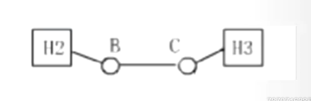

# 第一章 计算机网络概述

## 基本概念

### 计算机网络是什么？

计算机网络是**互连的**、**自治的**计算机**集合**。

网络的本质就是**数据交换**

### 最大最广泛的计算机网络————Internet/因特网

- ISP, Internet服务供应商
- 本地ISP、区域ISP、国家级ISP
- ISP网络由分组交换设备构成
- 分组交换设备：路由器（网络层）、交换机（链路层）

### 协议的概念

为进行网络中的数据交换而建立的规则、标准或约定即网络协议(network protocol)，简称为协议。

### 网络协议的产生

- 计算机网络的数据交换必须遵守事先约定好的规则
- 这些规则明确规定了所交换的数据的格式以及有关的同步问题（同步含有时序的意思）
- 网络协议必须考虑如何对付各种异常情况的出现。

### 协议三要素

- 语法，数据与控制信息的结构或格式。
- 语义，需要发出何种控制信息，完成何种动作以及做出何种响应。
- 时序，事件实现顺序的详细说明。

### 计算机网络功能：资源共享

- 硬件资源共享
- 软件资源共享
- 信息资源共享

### 网络分类————按覆盖范围分类 （选择、填空、简答）

- 个域网
- 局域网
- 城域网
- 广域网

### 网络分类————按拓扑结构分类 （选择、填空，注意优缺点）

- 将通信子网中的通信处理机、和其他通信设备**抽象成点**，把链接这些设备的**通信线路抽象成线**，并将由这些**点和线所构成的形状成为网络拓扑结构**。

- **星型**

    场景：局域网、个域网

    优点：易于监控和管理，故障诊断与隔离容易；

    缺点：中央节点是网络的瓶颈，一旦故障，全网瘫痪，网络规模受限于中央节点的端口数量。

- 环型

    场景：早期局域网、园区网和城域网

    优点：所需电缆长度短，可以使用光纤，易于避免冲突。

    缺点：某节点的故障容易引起全网瘫痪，新节点的加入或撤出过程比较麻烦，存在等待时间问题。
    
- **树形**

    场景：局域网

    优点：易于扩展，故障隔离容易；

    缺点：对根节点的可靠性要求高，一旦根节点故障，则困难导致网络大范围无法通信。
    
- 网状型

    场景：广域网、核心网络

    优点：网络可靠性高，一条或多条链路故障时，网络仍然可联通；

    缺点：网络结构复杂，造价成本高，选路协议复杂。
    
- **总线型**

    场景：早期局域网

    优点：结构简单，所需电缆数量少，易于扩展；

    缺点：通信范围受限，故障诊断与隔离较困难，容易产生冲突。
    
- 混合型

    场景：绝大多数实际都在用。

    优点：易于扩展，可以构建不同规模网络，并可根据需要优选网络结构。

    缺点：网络结构复杂，管理与维护复杂

### 网络分类————按交换方式分类

- 电路交换
- 报文交换
- 分组交换

### 网络分类————按用户属性分类

- 公用网：国家或企业出资，公共基础设施，例如电信、城市热点
- 私有网：军事、航空、银行、铁路等专用网。

## 网络结构

### 网络边缘

普通网络用户、网站

### 接入网络

- 电话拨号接入
- ADSL
- HFC接入
- 局域网
- 移动接入

### 网络核心

- ISP
- 实现网上传输数据的中继与转发，即数据交换

## 数据交换技术

- 数据交换设备
- 交换结点（即交换设备），通信子网

### 数据交换三种技术（简答、选择题）

- 电路交换
- 报文交换
- 分组交换

#### 电路交换

电路交换实在通信双方之间建立一条临时专用线路的过程

- 特点：数据传输前需要建立一条端到端的通路。
- 又称为“面向连接的”数据交换，典型例子：电话

电路交换过程包括：

- 电路建立
- 传输数据
- 拆除电路

电路交换特点是有链接的，在通信时需要**先建立电路连接**，在通信**过程中独占一个信道**，通信**结束后拆除电路连接**。

优点：**实时性高，时延和时延抖动都较小**；

缺点：对于突发性数据传输，**信道利用率低，且传输速率单一**。

适用场景： 语音和视频类实时性强的业务。

#### 报文交换

报文交换方式的数据传输单位是报文，报文就是站点一次性要发送的数据块，报文长度不限，可变长。

报文交换特点：

- 以报文为单位进行交换。
- 不需要在两个站之间建立专用通路。
- 传送方式采用“**存储——转发**”交换方式。

#### 分组交换（简答题）

将一个报文分成若干个分组，逐个发送分组。分组长度有一个上限，电信的最大长度是数千位字节。

分组交换特点：

- 分组交换是目前计算机网络广泛采用的技术
- 在发送端，先把较长的报文划分成较短的、固定长度的数据段。
- 分组交换的优点（简答题）

优点：（简答题）

1. 交换设备存储容量要求低
2. 交换速度快
3. 可靠传输速率高
4. 更加公平

## 网络性能

### 速率

- 速率基本单位bit/s (比特每秒)
- 进制转换： K/M/G/T
- 时间单位：毫秒ms、秒s
- 比特bit和字节Byte的关系，1 Byte = 8 bit

### 带宽的两重含义

- 频带宽度，HZ
- 信道的数据传输能力，bit/s（比特每秒）

### 网络时延（本章重点+难点）

- 处理时延
- 排队时延
- 传输时延 dt = L / R， L是传输总量， R是链路带宽
- 传播时延 dp = D / V， D是传播距离， V是传播速度
- 总时延就是上面全部加起来。

示例：

处理时延： B和C

排队时延一般由题目给出

传输时延：H2\B\C

传播时延：H2-B,B-C,C-H3

课后习题 12、13、14、15

- 时延带宽积，G=dp * R , 单位bit （这个时延是传播时延）

    时延带宽积=传播时延*带宽

- 丢包率
  
  丢包率=**丢失**分组总数/**发送**分组总数=(**发送**分组总数-**接收**分组总数)/**发送**分组总数

- 吞吐量，理解P39公式1-11（不用算，就是几段链路中**速度最慢的那个链路带宽值**）

## 体系结构

### 计算机网络的复杂性、异质性

- 不同的通信介质————有线、无线、……
- 不同种类的设备————主机、路由器、交换机……
- 不同的操作系统————Unix、Windows、……
- 不同的软/硬件、接口和通信约定（协议）
- 不同的应用环境————固定、移动、……
- 不同种类业务————分时、交互、实时、……

### 对于复杂的网络系统，如何能合理地组织网络的结构：

- 结构清晰
- 简化设计与实现
- 便于更新与维护
- 较强的独立性和适应性

### OIS参考模型（Open System Interconnection / Reference Model），简称OSI/RM，是由国际标准化组织（ISO）制定的标准化开放式计算机网络层次结构模型。（七层）

应用层（第二章）

表示层（抛弃）

对话层（抛弃）

运输层（第三章）

网络层（第四章）

数据链路层（第五章）

物理层（第六章）

### 两种服务类型（重点理解，贯穿主要内容）(简答题)

- 面向连接服务
- 无连接服务

### TCP/IP参考模型

- 传输控制协议TCP/IP(Transmission Control Protocol/Internet Protocol)是目前最常用道的一种通信协议，它是计算机世界里的一个通用协议。
- TCP/IP的四层网络体系结构已成主流。
- 在局域网中，TCP/IP最早出现在Unix系统中，现在几乎所有的厂商和操作系统都开始支持它。同时，TCP/IP也是Internet的基础协议。

TCP/IP参考模型的四层：

- 应用层=>对应OSI模型的应用层
- 传输层=>对应OSI模型的运输层
- 网络互联层=>对应OSI模型的网络层
- 网络接口层=>对应OSI模型的数据链路层+物理层

### 网络五层模型

#### 传输单位:

应用层：数据报文 数据包

传输层：报文段（段）   TCP报文段/UDP报文段

网络层：IP数据报  IP分组

链路层：帧

物理层：比特

## 发展历史

- 第一个分组交换计算机网络**ARPAnet**
- 三个因特网核心协议：**TCP、UDP、IP**
- 万维网WWW诞生
- 2000年开始，互联网爆发，进入“互联网+”时代

