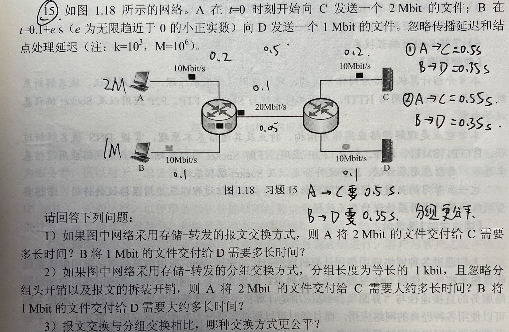

# 第一章课后习题

---

考虑 主机A 和 主机B 由一条带宽为*R*(bit/s)、长度为*D*的链路互连，信号传播速率为*V*(m/s)。假设主机A从*t*=0时刻开始向主机B发送分组，分组长度为*L*位。试求

1. 传播延迟（时延） $d_p$
2. 传输延迟 $d_t$
3. 若忽略节点处理延迟和排队延迟，则端到端延迟T是多少？
4. 若$d_p>d_t$，则$t=d_t$时刻,分组的第一位在哪里？
5. 若 V=250000 km/s，L=512 bit, R=100 Mbit/s, 则使时延带宽积刚好为一个分组长度(即512bit)的链路长度D是多少？

---

假设主机 A向主机 B 以存储—转发的分组交换方式发送一个大文件。主机 A到达主机 B的路径上有3段链路，其速率分别是 $R_1=500kbit/s,R_2=2 Mbit/s,R_3=1 Mbit/s$。试求

1. 假设网络没有其他流量，则该文件传送的吞吐量是多少？
2. 假设文件大小为4MB,则传输该文件到主机B大约需要多少时间？

---

假设主机A向主机B发送一个L=1500B的分组，主机A到达主机B的路径上有3段链路、2个分组交换机，3段链路长度分别为$D_1=5000km、D_2=4000km、D_3=1000km$;每段链路的传输速率均为R=2Mbit/s,信号传播速率为 V=250000km/s，分组交换机处理每个分组的时延为$d_c=3ms$。试求：

1. 若以存储—转发的分组交换方式，则该分组从主机A到达主机 B的端到端时延是多少？
2. 若$d_c=0$,且不采取存储—转发的分组交换方式，而是分组交换机直接转发收到的每个分组（即直通交换），则该分组从主机A到达主机B的端到端时延是多少？

---

