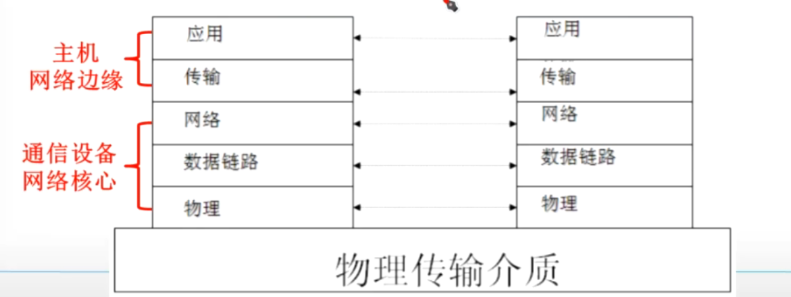
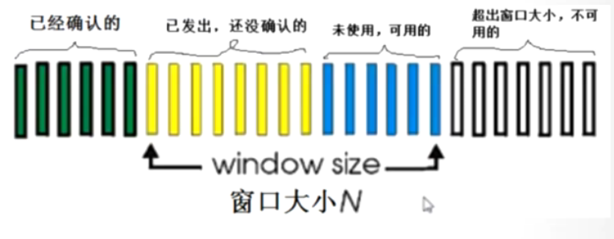
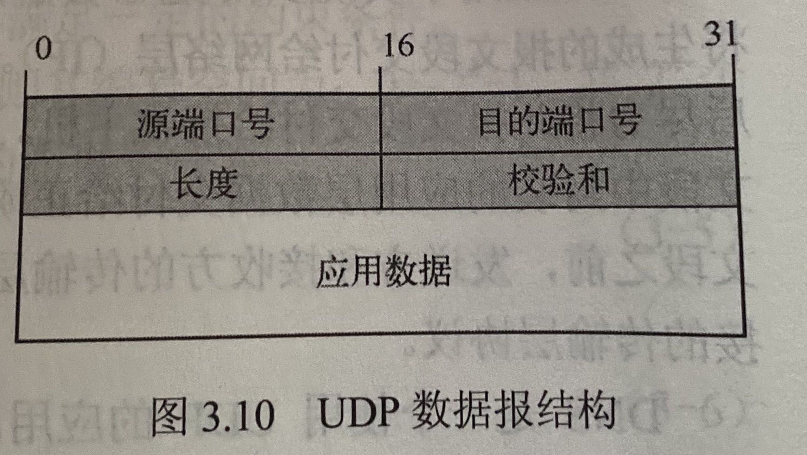
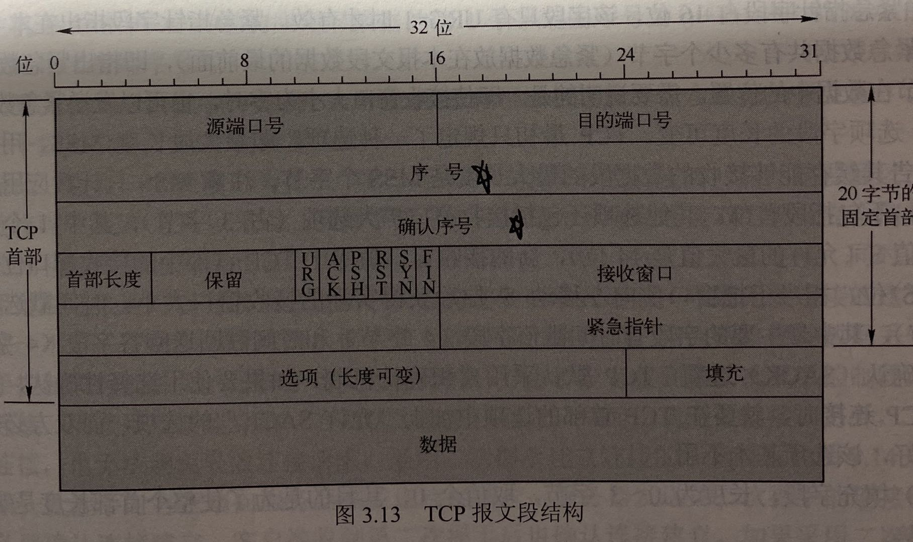
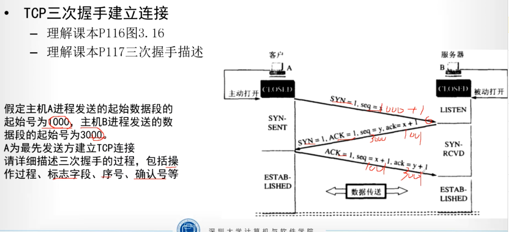
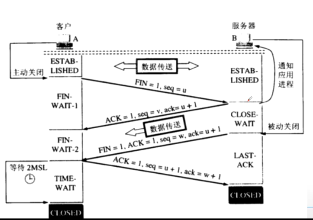

# 第三章 传输层 （考得最多）

## 传输层基本服务

- 主要功能：P91
  - 寻址
  - 报文分段与重组
  - 差错检测
  - 进程间端到端可靠数据传输
  - 面向应用层的复用与分解
  - 端到端流量控制
  - 拥塞控制
- 传输层的传输单元：报文段segment
- Internet的传输层协议
  - TCP，可靠数据传输服务
  - UDP，不提供可靠数据传输服务
- 只有主机才有传输层协议，网络的路由器等只用下三层协议
- 传输层中通信端点不是主机，是主机内的进程。

- 传输层寻址： IP地址+端口号
- 端口号分类：
  - 熟知端口号0~1023
  - 登记端口号1024~40151，在 IANA 上登记
  - 客户端口号或临时端口号40152~65535

## 复用与分解

- 传输层为什么要复用和分解：
  - 应用层多个进程（多个协议）公用一个传输层协议
  - 复用：多个应用进程公用一个传输层协议（应用层-->传输层）
  - 分解：传输层协议将数据交付不同的应用进程（传输层-->应用层）
- 复用和分解的关键
  - 传输层数据传输实际就是把数据交付给接收进程相关联的一个中间套接字
  - 关键就是传输层协议能够唯一标识一个套接字。
- 无连接的多路复用和分解’
  - Internet传输层的无连接服务的传输层协议UDP
  - 为UDP分配端口号的两种方法
    - 创建一个UDP套接字，自动分配端口号1024~65535
    - 创建一个UDP套接字，调用bind函数分配特定的端口号
    - UDP套接字端口号是UDP实现复用与分解的重要依据
- 标识UDP套接字的是一个二元组：目的IP地址+目的端口号
  - 接收数据，相同目的IP + 不同目的端口号，实现分解
  - 发送数据，不同目的IP + 任意目的端口号，实现复用
  - 理解P96图3.3
- 面向连接的多路复用和分解
  - Internet传输层的面向连接服务的传输层协议TCP 
- 标识TCP套接字的是一个四元组
  - 源IP地址+源端口号+目的IP地址+目的端口号
  - 四个元素标识唯一的套接字
  - 发送数据，四个元素一致实现复用
  - 接收数据，四个元素有一个不同就可以实现分解
  - 理解P96 图3.4

## 停等协议与滑动窗口协议

- 不可靠传输信道的不可靠性表现
  - 比特跳变
  - 传输乱序，迟发先到
  - 数据丢失
- 实现可靠数据传输的措施
  - 差错检测
  - 确认
  - 重传
  - 序号
  - 计时器
- 停等协议：每发送一个报文段就停下来等待接收方的确认
- 自动重传ARQ，最简单的停等协议
  - 概念：ACK、NAK
  - 通常不适用NAK，改进ACK带上确认报文段序列号
- 停等协议时序图，P101图3.5
  - PKT标识数据报，ACK表示确认信号
  - ACK0对应PKT0,ACK1对应PKT1，对应上就是成功
  - PKT0和PKT1的交叉表示不同的数据包，不是说只有两个数据包。
- 滑动窗口协议
  - 停等协议的缺点：P102的示例，主要时间浪费在等待上
  - 流水线协议的技术改进：连续发送，连续确认
  - 最典型的流水线传输TCP协议是**滑动窗口协议**
- 滑动窗口协议示例,P101图3.7
  - 发送窗口Ws（window size）、接收窗口Wr
  - 基序号 在图中是7
  - 下一个可用序号 在图中是15
  

- 滑动窗口协议包含两种代表
  - 回退N步协议：GBN 即Go-Back-N
    - Ws=N，Wr=1
    - 如果**计时器超时**，发送方**从第一个未确认序号n开始全部重发**
    - GBN协议适用于**错误码率低、丢包率低、带宽高时延积信道，且对接收方缓存能力要求低**
    - 缺点：会重传很多不必要重传的分组。
  - 选择重传协议，SR 即 Selective Repeat
    - Ws=N , Wr=N
    - 会对每个分组都进行计时
    - 如果计时器超时，发送方只重发未确认的分组
    - 需要接收方有缓存，需要改进确认方式。
    - 可以避免发送方重传已正确接收的分组。
    - 在信道差错率或丢包率增加的情况下，减少不必要的分组重传，改进协议的性能。
    - 信道利用率计算 P109 公式 3-8

- 滑动窗口协议的窗口大小与序列号空间需要满足的约束条件为

$$W_s=发送方窗口大小$$

$$W_r=接收方窗口大小$$

$$k=序号二进制位数$$

$$2^k = 编号空间大小$$

$$得到W_s+W_r\leq2^k$$

- 特殊情况下，对于GBN协议$W_r = 1$则有

$$W_s\leq2^k-1$$

- 对于典型的$W_s=W_r=W$的SR协议，有

$$W_s\leq2^{k-1}$$

- 对于停-等协议，可以看作特殊的滑动窗口协议，即 $W_s=W_r=1$，于是有$k\geq1$

- 信道利用率公式

$$U_{Sender}=\frac{W_s \times t_{Seg} }{t_{Seg}+RTT+t_{ACK}}$$

$$W_s=发送方窗口大小$$

$$W_r=接收方窗口大小$$

$$k=序号二进制位数$$

$$2^k = 编号空间大小$$

$$t_{seg}=传输时延$$

$$t_{seg}=L/R$$

$$L=数据长度$$

$$R是链路带宽$$

$$RTT是往返传播时延，包含来回两趟传播$$

$$tack是确认处理时延，一般忽略$$

## UDP

- 用户数据报协议UDP
  - Internet 传输层协议，提供无连接，不可靠、数据报尽力传输服务
  - 应用层协议DNS在传输层使用UDP协议
- 适合使用UDP的四个原因 P110
  - 应用进程更容易控制发送什么数据以及何时发送。
  - 无需建立连接
  - 无连接状态
  - 首部开销小
- UDP数据报结构，课本P110图3.10

- UDP首部长度固定式8个字节
- UDP首部固定包含4个字段，每个字段占2个字节（16bit）
- 源端口号+目的端口号，每个字段各占16bit
- 长度+校验和，每个字段各占16bit

## TCP

- 传输控制协议TCP
  - Internet传输层协议，提供面向连接、字节流、可靠有序、全双工服务。
- TCP报文段结构，P113
  - 固定头部20字节
  - 各个部分的含义
  - 重点掌握序号字段、确认序号字段，有计算
- TCP采取累积确认机制
  

- **源端口号与目的端口号字段分别占16位**，标识发送该报文段的源端口和目的端口，用于多路复用/分解来自或送到上层应用的数据。
- **序号字段与确认序号（接收方填写）字段分别占32位**。TCP的序号是对每个应用层数据的每个字节进行编号，因此每个TCP报文段的**序号是该段所封装的应用层数据的第一个字节的序号**。**确认序号是期望从对方接收数据的字节序号**，即该序号对应的字节尚未收到，该序号之前的字节已全部正确接收，也就是说，TCP采用累积确认机制。
- **首部长度字段占4位**，指出TCP段的首部长度，以4字节为计算单位，例如该字段值为5时，标识TCP段的首部长度为20字节。由于TCP选项字段的原因，TCP首部的长度是可变的。当该字段取最大值15时，标识TCP段的最大首部长度，即60字节。可见，TCP段的**选项字段最多为40字节**
- **保留字段占6位**，保留为今后使用，目前值为0.
- **URG、ACK、PSH、RST、SYN和FIN字段各占1位，共占6位，为6位标志位（字段）**。URG=1 时，表明紧急指针字段有效，通知系统此报文段中有经济数据，应尽快传送（相当于高优先级的数据）；ACK=1时，标识确认序号字段有效，当ACK=0时，确认序号字段无效；TCP收到PSH=1的报文段时，就尽快将报文段中的数据交付接收应用进程，而不再等到整个缓存都填满了后再向上交付；当RST=1时，表明TCP连接中出现严重差错，必须释放连接，然后重新建立TCP连接；SYN=1时，表示该TCP报文段是一个建立新连接请求控制段或者是同意建立新连接的确认段（此时ACK=1）；FIN用来释放一个TCP连接，当FIN=1时，表明该TCP报文段的发送端数据已发送完毕，并请求释放TCP连接。
- **接收窗口字段占16位**，用于向对方通告接收窗口大小（单位为字节），表示接收方愿意（或还可以）接收的应用层数据字节数量，其值是本端接收对方数据的缓存剩余空间，用于实现TCP的流量控制
- **紧急指针字段占16位**，该字段只有URG=1时才有效。紧急指针字段只出在本TCP报文段中紧急数据共有多少个字节（紧急数据放在本报文段数据的最前面），即只出紧急数据最后一个字节在数据中的位置。需要说明的是，即使接收窗口大小为零时，也可以发送紧急数据。
- **选项字段的长度可变**。TCP最初只规定了一种选项，即最大段长度MSS，用于对方TCP通告其缓存能够接收的数据段的最大长度是MSS个字节。注意MSS只计数应用层数据字节数，不包括段首部。
- **填充字段，长度为0~3字节，取值全0**，其目的是为了使整个首部长度是4字节的整数倍。

- TCP三次握手建立连接

- TCP四次挥手断开连接

- TCP可靠数据传输实现的工作机制
  - 六种措施
    - 应用数据被分割成TCP认为最适合发送的数据块（通常是MSS），封装成TCP段，传递给IP。
    - 当TCP发出一个段后，启动一个计时器，等待目的端确认收到这个报文段。如果不能及时收到一个确认，则认为该报文段丢失，将重发这个报文段。当TCP收到发自TCP链接另一端的数据，将发送一个确认段。
    - TCP首部中设有“校验和”字段，用于检测数据在传输过程中是否发生差错。如果收到的报文段通过校验和检测，发现有差错，TCP将丢弃这个报文段和不确认收到此报文段（希望发送端超时并重发），而将已连续接收到的应用层数据的最后一个字节的序号+1，作为确认序号，向发送方发送确认段。
    - 由于TCP报文段封装到IP数据报中传输，而IP数据报的到达可能会经过不同的路径从而造成顺序的错乱，因此TCP报文段的到达也可能会失序。如果必要，TCP将根据序号对收到的数据进行重新排序，将收到的数据以正确的顺序交给应用层。
    - 由于存在网络延迟和重传机制，TCP的接收端有可能会收到多个重复的报文段，这时接收端需要根据序号把重复的报文段丢弃。
    - TCP能够提供流量控制。TCP连接的每一方都在简历连接时分配一定大小的接收缓冲空间。TCP的接收端只允许另一端发送接收端缓冲区所能接纳的数据。这可以防止较快主机发送数据太快，芝士搅蛮主机的缓冲区溢出。
- 发送方与发送和重传相关的三个事件
  - 从上层应用程序接受数据
  - 定时器超时
  - 收到ACK
- TCP确认与重传的典型场景
  - ACK丢失导致重传
  - 累积确认避免重传
- TCP接收方生成ACK的策略
  - 具有所期望序号的报文段按序到达，所有在期望序号及以前的报文段都已被确认
  - 具有所期望序号的报文段按序到达，且另一个按序报文段在等待ACK传输，TCP接收方立即发送单个累积ACK，已确认以上两个按序到达的报文段。
  - 拥有序号大于期望序号的失序报文段到达，TCP接收方立即发送重复ACK，即对当前接收窗口继续好进行确认，指示下一个期待接受字节的序号。
  - 收到一个报文段，部分或完全填充接收数据间隔（缺失）。

- TCP流量控制
  - TCP首部限制接收窗口大小
- TCP拥塞控制
  - 分为拥塞未发生和拥塞发生两种情况
  - 拥塞未发生，发送方加快发送速度，直到网络不能承受。
  - 拥塞发生，根据接收方的不同相应，发送方做不同的降速。
- 拥塞未发生时分两个阶段：慢启动和拥塞避免
  - 两个参数：发送拥塞窗口大小、阈值，时间单位是MSS
  - 慢启动：窗口地域阈值时，每过一个RTT，窗口翻倍
    - 理解P125 图 3.20
    - 直到窗口大于阈值，从慢启动切换到拥塞避免
  - 拥塞避免：每过一个RTT，窗口+1，直到拥塞发生
  - 注意：阈值和拥塞是否发生无关，只是控制阶段切换。
- 拥塞发生时分两种情形：3次重复确认、超时
  - 两个参数：发送拥塞窗口大小、阈值，事件单位是MSS
  - 3次重复确认（**快速恢复**算法，TCP-Reno版本）
    - 状态设为拥塞避免
    - **阈值设为**当前拥塞窗口**一半**
    - **拥塞窗口**也**设**为当前拥塞窗口的**一半**
  - 超时（**快速重传**算法，TCP-Tahoe版本）
    - 状态切换回**慢启动**
    - **阈值设为**当前拥塞窗口**一半**
    - 拥塞窗口置1
  - 重点理解P126 图3.22