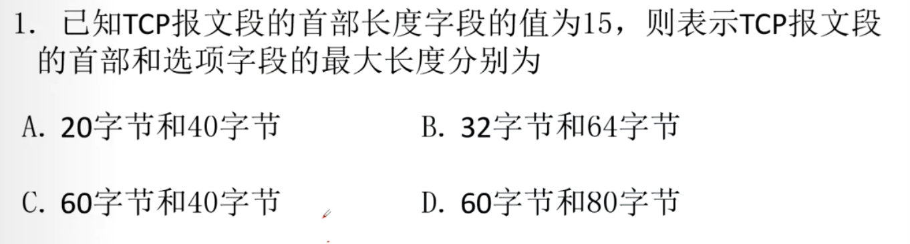
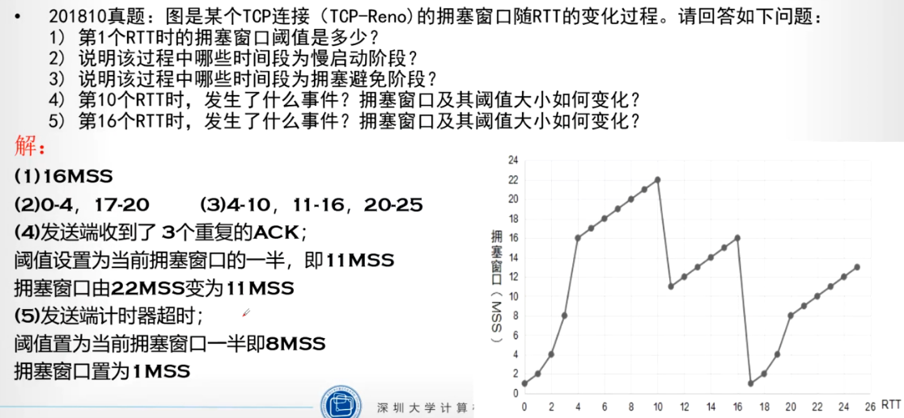

# 第三章课后习题

TCP接收方生成ACK的四种策略？

- TCP接收方生成ACK的策略
  - 具有所期望序号的报文段按序到达，所有在期望序号及以前的报文段都已被确认
  - 具有所期望序号的报文段按序到达，且另一个按序报文段在等待ACK传输，TCP接收方立即发送单个累积ACK，已确认以上两个按序到达的报文段。
  - 拥有序号大于期望序号的失序报文段到达，TCP接收方立即发送重复ACK，即对当前接收窗口继续好进行确认，指示下一个期待接受字节的序号。
  - 收到一个报文段，部分或完全填充接收数据间隔（缺失）。

