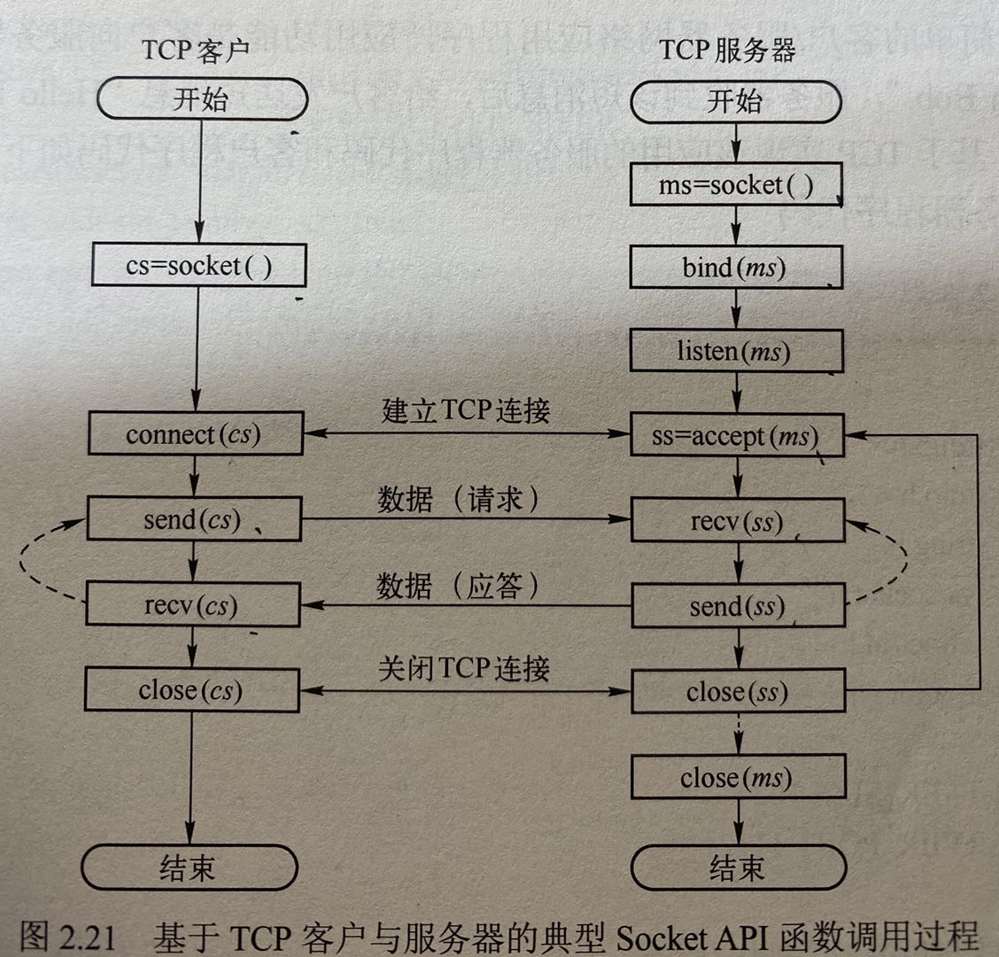
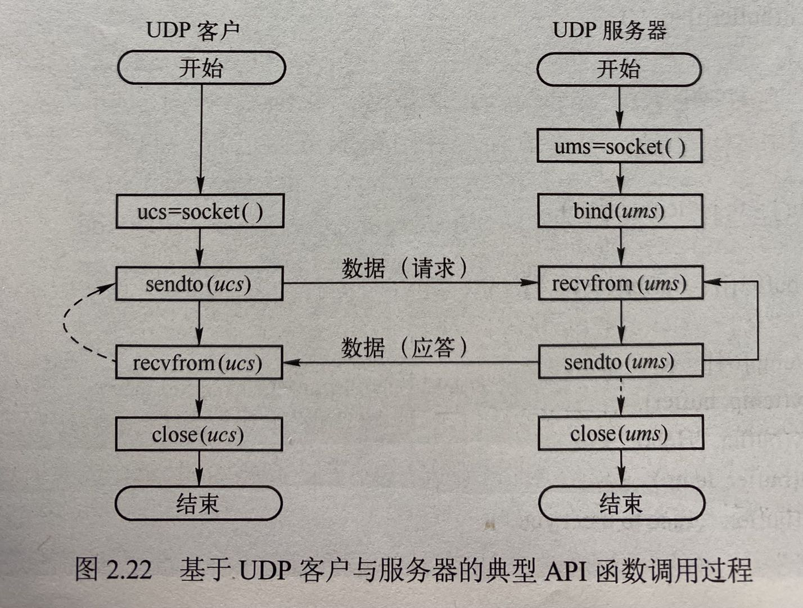

# 第二章 网络应用

## 网络应用体系结构

### 网络应用三种体系结构

- C/S (Client / Server)
- P2P
- 混合

#### C/S结构

- 客户/服务器(C/S)结构，最基本最典型的网络应用结构
- 客户程序+服务器程序
- 主要特征：
  - 网络通信只在客户与服务器之间进行
  - 客户之间相互不通信
  - 客户端主动发起通信，服务器端被动接受通信

#### P2P结构

- 所有通信都是对等的通信方之间进行，没有客户与服务器之分，地位对等。
- P2P的每个对等端都是客户与服务器的结合体。
- 应用：文件分发、文件共享、视频流服务、BitTorent、Gnutella

#### 混合结构

- C/S和P2P相结合，既有服务器的存在，也有对等端客户的直接通信。

## 网络应用通信基本原理

- 应用层通信过程：应用进程之间以C/S方式进行通信
  - 服务器进程被动等待客户通信
  - 客户进程主动发起通信
  
- 在逻辑上，是两个应用层的进程直接交换数据，实际上应用层程序通过层间接口API，往下传递数据给传输层，按照五层模型的方式来交换信息。（课本P53的图2.4）

- 典型的网络应用编程接口： 套接字(Socket)
  - 一个应用进程对多个传输层协议
  - 每个协议对应一个接口I，每个接口用一个套接字socket进行绑定binding
  
- 系统为每个套接字分配一个编号，就是端口号port number
  - 服务器进程的端口号是特定的
  - 客户进程的端口号是随机分配且唯一
  - 例如WEB端口80

- 应用层需要使用传输层的服务，传输层提供两种服务
  - TCP，面向链接，可靠，字节流传输服务
  - UDP，无连接，不可靠，数据报传输服务
  - 两种服务具体介绍在下一章。

## 域名系统

- 主机IP地址
  - 为了确保通信室能相互识别，在Internet上的每台主机都必须有一个唯一的标识，即主机的IP地址。
  - 在网络层，IP协议就是根据IP地址实现信息传递的。
  - IP地址由32位（即4字节）二进制数组成，为书写方便起见，常将每个字节作为一段并以十进制数来标识，每段间隔用“.”分割。
  - 例如，202.96.209.5就是一个合法的IP地址。

- 普通用户不习惯记忆和使用IP地址，因此希望网络地址更加容易记忆，因此设计了域名，更加容易记忆。
- 域名系统就是：将域名和它的IP地址之间建立起一种映射关系
  - 域名由多个分量组成，各分量之间用“.”分隔开
  - 各分量代表不同级别的域名
  - 级别最低的域名在最左边，级别最高的域名在最右边（顶级域名）
  - 每一级域名由英文字母或数字组成
  - n级域名.n-1级域名.n-2级域名……顶级域名

- 域名结构
  - 级别最低的域名在最左边，级别最高的在最右边（顶级域名）

- 域名层次化域名空间
  - 国家顶级域名：.cn \ .us \ uk
  - 通用顶级域名：.com \ .net \ .gov \ .edu
  - 基础结构域名：arpa

- Internet上的域名由域名系统DNS(Domain Name System)统一管理
- DNS是一个分布式数据库系统，包含三部分：
  - 域名空间
  - 域名服务器
  - 地址转换请求程序
- 有了DNS，凡域名空间中有定义的域名可以有效地转换为对应的IP地址，同样，IP地址也可通过DNS转换成域名。

- DNS服务器的组织方式，包含四种类型的DNS服务器：
  - **根**域名服务器：因特网上共有13个根DNS服务器；
    - 根域名服务器不做域名解析，它知道所有顶级域服务器的IP地址
  - **顶级**域名服务器
  - **权威**域名服务器
  - **中间**域名服务器
  - 每台主机都会配置一个默认域名服务器，即**本地域名服务器**。

- DNS服务器的组织方式，包含四种类型的DNS服务器：
  - 根域名服务器：因特网上共有13个根DNS服务器
    - 根域名服务器不做域名解析，它知道所有顶级域服务器的IP地址
  - 顶级域名服务器
- 域名解析过程，理解P57图2.7和2.8
  - 本地域名服务器->根域名服务器->顶级域名服务器->权威域名服务器
  - 递归查询，每次查询由其他域名服务器转发查询
  - 迭代查询，每次查询由本地域名服务器和其他域名服务器直接对话
- **改进**域名系统查询**效率**：域名服务器**增加缓存机制**

## 万维网

- WWW是World Wide Web的缩写，也简称Web，从用户角度来看，Web是由数量巨大且遍布全球的文档组成，这些文档成为Web页（Web page）。
- 万维网简称Web应用，组成部分
  - Web服务器
  - 浏览器
  - 超文本传输协议HTTP，理解图P58 2.9

- URL是为了在因特网上查询不同信息资源有统一的访问方法，而定义的一种地址标识方法。
- 因特网上所有资源都有一个URL地址，而且是独一无二的
- URL的完整格式：主机域名+对象路径名
  - 协议： //主机名或IP地址：端口号/路径名/文件名

- HTTP协议：浏览器与Web服务器之间通信使用的协议，规定了客户方与服务器方通信所使用的命令及响应。
  - HTTP1.0,第一个广泛应用的版本
  - HTTP1.1,目前Web应用最广泛的HTTP版本
  - HTTP2.0,最新版本，尚未广泛应用。
- HTTP连接（主要知识点）
  - HTTP1.0，非持久连接
  - HTTP1.0，非持久+并行连接
  - HTTP1.1，非流水方式持久连接
  - HTTP1.1，流水方式持久连接

例如：用户端访问一个带有三张引用图片的web网站。用以上四种方式传输数据，需要多少个RTT?

1. HTTP1.0 非持久非并行连接 需要 8 个RTT 次次请求都要重新建立连接
   - 4次建立TCP连接的RTT 
   - 1次请求-返回Web页的RTT 
   - 3次请求-返回图像的RTT
2. HTTP1.0 非持久+并行连接 需要 4 个RTT 信息的传输是建立并行连接的
   - 1次建立TCP连接的RTT
   - 1次请求-返回Web页的RTT 
   - 1次并行建立三条连接的RTT
   - 1次并行返回三个图像的RTT
3. HTTP1.1 持久+非流水 需要 5 个RTT 需要逐个请求图像
   - 1次建立TCP连接的RTT
   - 1次请求-返回Web页
   - 3次请求-返回图像的RTT
4. HTTP1.1 持久+流水 需要 3 个 RTT 因为只需要建立一次连接
   - 1次建立TCP连接的RTT
   - 1次请求-返回Web页的RTT
   - 1次传输图像的RTT

- HTTP报文
  - 四部分组成（请求行、首部行、空白行、报文主体）
  - 起始行（请求行）和空白行是不可缺少的
- HTTP报文类型：请求报文、响应报文 不同之处在于起始行（请求行）
  - 两种报文结构：P62两个图
  - **HTTP请求方法，P63，理解各种方法**
    - GET 请求读取由URL所标识的信息
    - HEAD 请求读取由URL首部
    - POST 给服务器添加信息
    - OPTION 请求一些选项信息
    - PUT 在URL下存储某文档
  - HTTP状态码表，P64表2.2，常见的404、401

- HTTP是无状态协议，Web应用引入Cookie机制跟踪用户
- Cookie，一种小型文本文件，用于网络应用的**身份识别、会话跟踪**等功能，存储在用户**本地**终端。P64
- Cookie工作原理，四类Cookie信息，理解P65 图2.16
  - 客户端Cookie信息（文本文件）
  - 服务器端Cookie信息（数据库）
  - 响应报文携带的Cookie信息
  - 请求报文携带的Cookie信息
- Cookie分类：
  - 会话Cookie
  - 永久Cookie
- Cookie最常见的五个用途是什么？
  - 网站可以利用Cookie的ID来统计数据
  - 网站可以利用Cookie限制某些特定用户的访问
  - 网站可以存储用户的操作习惯和偏好，针对性地为用户提供服务，提升用户体验。
  - 记录用户信息，无需重复登陆。
  - 实现购物车功能。

## 电子邮件

协议都是应用层协议

- 电子邮件系统结构，理解P67 图 2.17
  - 邮件服务器
  - 用户代理
  - 简单邮件传输协议SMTP
  - 邮件读取协议
- E-mail地址的格式为： 用户名@主机域名
  - 用户名是用户在邮件服务器上的信箱名，通常为用户的注册名、姓名或其它代号
  - 主机域名则是邮件服务器的域名。用户名和主机域名之间用“@”分隔。
- 典型的电子邮件用户代理：Outlook、Apple Mail、Fox Mail
  - SMTP默认端口25
  - 典型邮件读取协议：POP3、IMAP
  - 注意：SMTP是邮件发送协议
- SMTP是电子邮件核心应用层协议
  - SMTP基于TCP协议，包含三个阶段的邮件传输
  - SMTP基本交互方式 P69
- 邮件格式标准 RFC822
  - 理解邮件格式内容： To、Subject、Cc等 P70
    - To（必填）：收件人邮件地址
    - Subject：邮件主题
    - Cc：应给某人发送一个邮件副本
    - From：发件人邮箱地址
    - Date：发信日期
    - Reply-To：对方回信所用地址
- SMTP用于发送邮件，因此邮件读取需要其他协议，常用有三种
  - 邮局协议POP3
    - 使用TCP、端口号110
  - 互联网邮件访问协议IMAP
    - 将邮件与一个文件夹关联
    - 支持用户远程创建文件夹，并把邮件指派到一个文件夹
  - WebMail系统的HTTP
    - 基于Web邮件系统的协议
    - 用户读取邮件用HTTP
    - 用户发送邮件到服务器用HTTP
    - 邮件服务器之间仍然用SMTP

## FTP

- 文件传输协议FTP：规定了两台计算机上的FTP软件如何进行交互
- FTP使用两条TCP连接完成文件传输：
  - 控制连接：使用端口21，用于传送客户的命令和服务器的响应；控制连接在整个会话期间一直保持。
  - 数据连接：使用端口20，用于传输文件，每个数据连接之传输一个文件；FTP用哪个关闭连接来表示一个文件传输结束。
  - FTP会话形式：客户发送命令，服务器应答
  - FTP命令参考，P75
    - USER username,用于向服务器传送用户标识
    - PASS password 用于向服务器发送用户口令。
    - LIST，用于请求服务器回送当前远程目录中所有文件列表。
    - RETR filename 用于从FTP服务器的当前目录下载文件
    - STOR filename 用于向FTP服务器的当前目录上传文件

## P2P应用

- P2P应用：BitTorent、PPlive、Ppstream
  - P2P在文件分发、文件共享等应用性能表现优异
- 理解两种文件分发时间计算公式 P76 公式2-1\2-1\2-3

## Socket编程基础

- Internet应用最广泛的互联网应用编程接口： Socket API
  - 理解三种类型Socket
    - 数据报类型套接字SOCK_DGRAM：面向传输层UDP接口
    - 流式套接字SOCK_STREAM：面向传输层TCP接口
    - 原始套接字SOCK_RAW：面向网络层协议接口（如IP、ICMP等）
- 识记Socket API函数，P78-79
  - socket、close、bind、listen、connect
    - socket:创建套接字
    - close(x):关闭描述符为x的套接字
    - bind:绑定套接字的本地端点地址
    - listen(x,y):置服务器端的流（TCP）套接字x为监听状态
    - connect(x,y,z):将客户套接字x与服务器连接
- Socket API调用过程，理解P81两个图

