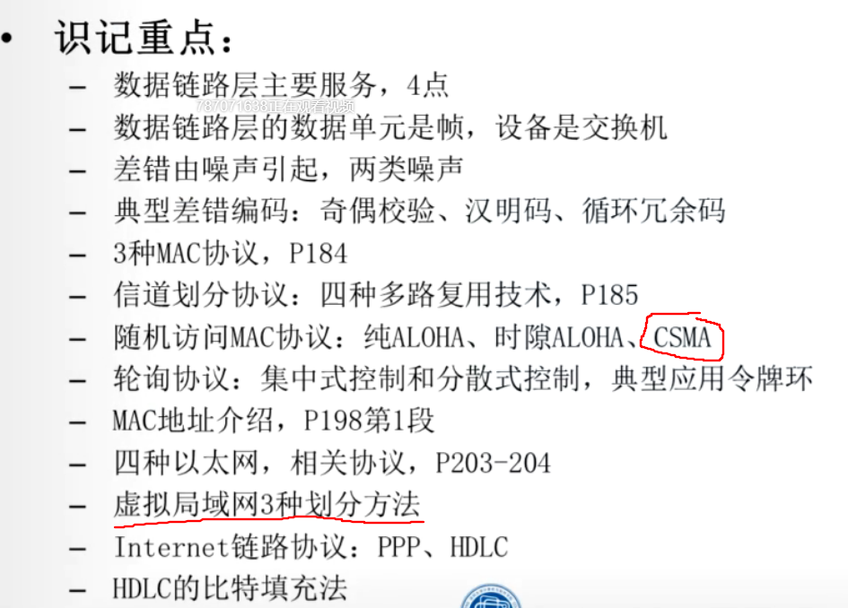
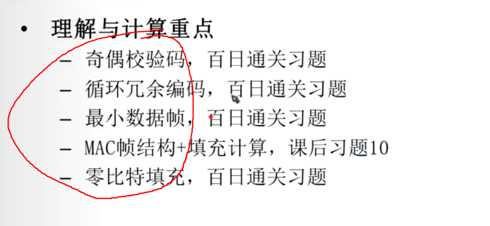

# 第五章 数据链路层与局域网

- 帧是数据链路层的传送单位
  - 数据链路层将比特流组织成以帧为单位传送
  - 若传输中发生差错，只需要将出错的有限数据进行重发（帧）
- 数据链路层的服务
  - 组帧
  - 链路接入
  - 可靠交付
  - 差错控制

## 差错控制

- 产生差错的原因：噪声
  - 随机噪声
  - 冲击噪声
- 差错控制基本方式
  - 检错重发
  - 前向纠错，适用于单工链路或实时性要求高
  - 反馈校验
  - 检错丢弃
  - 差错编码原理 图5.2理解
- 差错编码的检错能力与纠错能力
  - 汉明距离、
- 奇偶校验码，是一种检错码
  - 增加一个冗余位
  - 奇校验码，冗余位使得码字中“1”的个数为奇数
  - 偶校验码，冗余位使得码字中“1”的个数为偶数
- 汉明码，实现单个纠错，在数据通信和数据存储广泛应用
- 运用冗余位标识出错，公式5-5
- 表格5.1用于查找出错位
- 表格5.2用于已知信息为，求出冗余位
- 循环冗余码（CRC，Cyclic Redundancy check）
  - 因为奇偶校验漏检率太高，因此采用漏检率低且方便实现的CRC校验。CRC校验码又称为多项式编码
  - 在数据链路层协议中广泛使用
  - 生成码多项式极其算术运算

## 多路控制访问协议

- 计算机网络可以分成两类
  - 点到点通信，例如广域网
  - 广播通信，使用广播信道的网络，例如局域网
- 广播网络的关键问题：如何解决对信道争用。 

- 解决信道争用的协议称为介质访问控制协议MAC
  - MAC（Medium Access Control）协议，是数据链路层协议的一部分
  - 信道划分MAC协议
    - 频分多路复用FDMA,理解图5.4 2G
    - 时分多路复用TDMA,理解图5.5
      - 同步时分多路复用
      - 异步时分多路复用
      - 我国3G技术标准TDMA
    - 波分多路复用WDMA,理解图5.6
    - 码分多路复用CDMA,利用相互正交码组分别编码，再混合传输
      - 即CDMA技术，3G时代主流技术
  - 随机访问MACA协议
  - 受控加入MACA协议

- 随机访问MAC协议，早期版本是ALOHA协议
  - 纯ALOHA协议（Pure ALOHA）
    - 每个站点只要有数据就可发送
    - 通过监听信道来发现是否发生冲突
    - 若冲突，则等待一段随机时间，再重新发送。
    - 网络负载最大0.5，信道利用率最高18.4%
  - 时隙ALOHA协议（Slotted ALOHA）
    - 将信道事件分为离散的时间片，每个时间片可以用来发送一个帧
    - 一个站点有数据发送时，必须等到下一个时间片的开始才能发送
    - 与纯ALOHA相比信道的利用率提高一倍，网络负载最大1，信道利用率最高36.8%
  - 随机访问MAC协议，最常用的是载波侦听多路访问（CSMA）协议
    - 载波对两种ALOHA的改进，就是增加了一个载波监听装置
    - “先听后说”，通过载波监听装置，在每次发送前监听其他站点是否发送数据，若有就暂时不发送，减少发送冲突的可能
  - CSMA四种监听方式
    - 非坚持CSMA
    - 1-坚持CSMA
    - p-坚持CSMA
    - 带有冲突检测的CSMA/CD

  - CSMA/CD协议
    - 带有冲突检测的载波真挺多路访问协议
    - 前面三种CSMA协议的缺点：发送前监听是否空闲，发送时即使监听到冲突，仍然要把剩余数据发送完才停止，浪费带宽和时间
    - 改进，在发送过程中监听到冲突就立刻停止发送。
  - CSMA/CD协议广泛应用于局域网中
    - 监听到信道空闲，就立即发送数据，且边发边监听
    - 若监听到冲突，冲突方立即停止发送，并发送干扰信号串强化冲突，通知全网站点，使信道很快空闲
    - 随后各自等待一段随机事件，发现信道空闲又发送数据，经过几轮竞争后有一个节点发送成功

- 最小帧长的计算
  - 课本P194,公式5-20
  - 理解距离S、速率R、最小帧长Lmin三者关系
  - 课本P195 例子5.4

- 受控接入MAC协议
  - 前面介绍的都是争用协议，针对有冲突的情况
  - 引用无冲突协议，无冲突的解决信道争用问题
  - 集中式控制，传递轮询
  - 分散式控制，令牌技术
    - 令牌环网，令牌环的操作过程

## 局域网

- IEEE802标准是局域网的国际标准系列，由ISO采纳
  - 数据链路层又分为逻辑链路控制LLC和介质访问控制MAC两个子层
  - 实际上LLC层已几乎无用
- IEEE802是一个标准系列，包括：802.1--802.16
  - 802.2 - 逻辑链路控制
  - 802.3 - CSMA/CD（以太网） 
  - 都是有线局域网
- 数据链路层寻址与ARP
  - IP--ARP--MAC 通过ARP协议把IP地址和MAC地址的映射
- MAC地址格式
  - 6个字节48bit，十六进制表示，课本P198第1段
  - MAC地址具有唯一性
  - MAC广播地址，48bit全是1，十六进制全是6个FF
- ARP表负责解析IP地址到MAC地址
- 以太网Ethernet代表有线局域网技术标准
  - 经典以太网技术指标 P201最后一段
  - 理解经典以太网争用期是51.2us
  - 理解截断二进制指数退避算法，P202第二段
- 以太网帧结构
  - 使用曼彻斯特编码发送
  - 使用截断二进制指数退避算法确定重传时机
  - 理解P202表格
  - 数据部分长度是46-1500字节
  - 至少是46+18=64字节

- 交换机是数据链路层的主要设别，也是以太网的主要网络设备
  - 网络拓扑为星型结构，站点采用全双工方式进行通信，允许多个站点同时交换数据
  - 交换机的转发和过滤
  - 以太网交换机的自学习
  - 理解图5.18
  - 优点
    - 消除冲突
    - 支持异质链路
    - 网络管理

- 虚拟局域网
  - 是一种基于交换机（必须支持VLAN功能）的逻辑分割（或限制）广播域的局域网应用形式。
  - 划分方法
    - 基于交换机端口划分
    - 基于MAC地址划分
    - 基于上层协议类型或地址划分

## 点对点链路协议

- PPP协议
  - 三类功能 P208
    - 成帧
    - 链路控制协议
    - 网络控制协议
    - PPP数据帧帧格式：开头为01111110 结束为01111110
- HDLC协议
  - 帧格式：开头为01111110 结束为01111110
  - 三种帧类型
    - 信息帧（I格式）
    - 管理帧（S格式）
    - 无序号帧（U格式）

