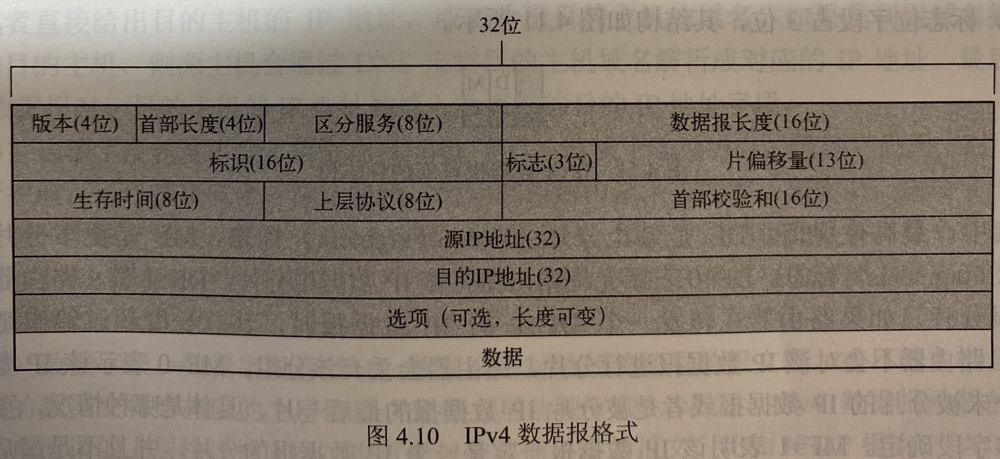

# 第四章 网络层

## 网络层服务

- 网络层主要功能：P132
  - 转发
  - 路由选择，路由算法概念
- 路由器转发表
  - 交换或收集路由信息
  - 计算路由
  - 路由信息存储在转发表

## 虚电路与数据报

- 网络层服务分为：数据报服务（无连接）、虚电路服务（面向连接）
  - 数据报网络
    - 需要路由
    - 无连接服务
    - 因特网属于数据报网络
  - 虚电路网络
    - 面向连接的分组服务（分组交换网络）
    - 虚电路是网络层的逻辑连接，区别于电路交换
    - 每条虚电路有虚电路号VCID
      - 虚电路三个要素 P133
        - 理解P133图和表格
      - 虚电路分组交换两种类型
        - 永久型、交换性
      - 虚电路与数据报的区别
        - 是将顺序控制、差错控制和流量控制等功能交由网络来完成，还是由端系统来完成。。
        - 虚电路网络（如ATM网络）通常由网络完成这些功能，向端系统提供无差错数据传送服务。
        - 数据报网络（如Internet）通常网络实现的很简单，如基本的路由与转发，顺序控制、差错控制和流量控制等功能则由端系统来完成

## 网络互连与设备

- 异构网络概念，互连策略
  - 协议转换
  - 构建虚拟互联网络
- IP网络、Internet都是虚拟互联网
- 网络互连设备，P135第二段中间
  - 协议转换的交换机和网桥
  - 多协议路由器
  - 应用网关
- Internet的网络互连设备——IP路由器
- 网络互连典型技术——隧道技术
- 路由器功能结构（简答题）
  - 主要任务是获取与维护路由信息以及转发分组
  - 输入端口，功能：把数据报封装在链路层的帧中
  - 交换结构，三种交换结构，三种结构的性价比
    - 基于内存交换 性能低 价格便宜
    - 基于网络交换 性能最好 比较昂贵
    - 基于总线交换
  - 输出端口，功能：把从链路层的帧组装成数据报
  - 路由处理器，路由的两项最重要的功能
    - 转发：最长前缀匹配优先原则
    - 路由选择

## 网络层拥塞控制

- 概念
  - 在分组交换网中，由于众多的用户随机地将信息送入网络，使网络中需要传输的信息总量经常大于其传输能力，以至于某些网络结点（如路由器）因缓冲区已满，无法接收新到达的分组，此时就发生了所谓的拥塞现象。
- 拥塞控制概念
  - 拥塞控制与流量控制的区别
    - 流量控制是发送数据一方根据接收数据一方的接收数据的能力，包括接收缓存、处理速度等，调整数据发送速率和数据量，以避免接收方被数据淹没；
    - 拥塞控制是根据网络的通过能力火网络拥挤程度，来调整数据发送速率和数据量。
    - 拥塞控制主要考虑端系统之间的网络环境，目的是使网络负载不超过网络的传送能力；
    - 流量控制主要考虑接收端的数据接收与处理能力，目的是使发送端的发送速率不超过接收端的接收能力。
    - 拥塞控制的任务是确保网络能够承载所达到的流量
    - 流量控制只与特定的发送方和特定的接收方之间的点到点流量有关。
  - 拥塞控制分为拥塞预防、拥塞消除两类措施
    - 拥塞预防：增加网络资源
    - 拥塞消除：减少网络负载
  - 拥塞发生的原因
    - 缓冲区容量有限
    - 传输线路的带宽有限
    - 网络结点的处理能力有限
    - 网络中某些部分发生了故障
- 拥塞控制措施
  - 流量感知路由（属于拥塞预防）
    - 网络中链路权值根据网络负载动态调整
    - 改进方法：多路径路由，负载逐步迁移法
  - 准入控制，广泛应用于虚电路网络，属于拥塞预防
    - 虚电路审核，根据平均流量和瞬时流量判断是否建立新的虚电图
  - 流量调节 - 属于拥塞消除
    - 抑制分组+背压
  - 负载脱落 - 属于拥塞消除
    - 选择丢掉哪些数据报，根据应用类型决定丢掉新的还是旧的
    - 文件传输适合丢掉新的
    - 视频流适合丢旧的

## Internet网络层

- Internet网络层主要协议： IP协议(1个)、路由协议(多个)、ICMP协议(1个)
- IPv4结构表格与字段含义，P143

  - 标志 - 3位
    - DF:(Don't Fragment) 禁止分片的标志 DF=0时允许分片 DF=1时禁止分片
    - MF:(More Fragment) 更多分片标志 MF=1表示还有更多分片 MF=0时表示没有更多分片，但是MF=0时还要看具体情况。
  - 片偏移 - 13位
    - 表示一个IP数据报分片封装与原IP数据报数据的相对偏移量，即封装的数据分片从圆整个数据报的哪个字节开始，但片偏移量以8字节为单位。
  - 当片偏移=0  MF=0 表示这是一个未被分片的数据报
  - 当片偏移=0，MF=1 表示这是一个IP分片，且是第一个分片。

- 一个IP地址分为两部分：子网地址（前缀）+主机地址（后缀）
- IPv4分类地址：前缀部分长度固定，分为ABCDE，P149
  - A类，1+3,首数字0~127
  - B类，2+2,首数字128~191
  - C类，3+1,首数字192~223
  - D类，特殊用途，首数字224~239
  - E类，特殊用途，首数字240~255
- IPv4地址分类
  - 特殊地址P150
    - 本地主机地址：0.0.0.0/32
    - 有限广播地址：255.255.255.255/32。当主机或者路由器某端口，需要向其所在网络中的所有设备发送数据报时，用该地址作为IP数据报的IP地址。
  - 私有地址，内网使用，公网丢弃
  - 无类地址CIDR，前缀部分长度不固定。
- 子网划分，采用CIDR技术，通过子网掩码标识子网地址长度。
  - 子网表示一段范围内的IP地址，子网内的IP直接相互通信，无需再寻址
- IP地址=子网地址+主机地址/子网掩码
  - 子网地址格式上是一个IP地址，含义是一个子网，表示一段范围内的IP
  - 主机地址格式上是一个IP地址，含义是一个子网中某台电脑的IP
  - 子网掩码格式上是一个IP地址，含义是表示子网的范围
  - **子网地址 = IP地址 and 子网掩码**
  - 子网地址 = IP地址与子网掩码做与运算
- 子网掩码含义
  - 子网掩码是32bit中，前n个位是1，后（32-n）个位是0，不存在0和1混杂，必定是前1后0
  - 若掩码中1个数是x，则$2^{32-x}$表示子网的IP数
  - 例如255.255.255.128,转成二进制码得到前25位是1，后7为是0，则用子网掩码去表示子网，则前25bit是子网地址，后7bit是主机地址，因为$2^7$是128，表示该子网最多包含128个主机，实际可用是126台。实际可用是126是因为 全为0和全为1的地址是用来广播和本地作用的。因此IP总数是128，可用总数是126.
  - 子网地址+子网掩码示例
    - 已知192.168.112.37/26是子网中某个IP，26表示掩码的前26bit是1
    - 因为26=8+8+8+2，所以掩码前三个整数都是255，最后一个8个比特的前两个比特是1，所以掩码的最后一个数字=$2^7+2^6=128+64=192$
    - 得到掩码的十进制表示为255.255.255.192
  - 子网地址+子网掩码示例
    - 二进制与运算：0与0=0；0与1=0；1与0=1；1与1=1；
      - 例如已知192.168.112.37/26，求子网地址
- 子网划分，给出任一IP地址和掩码长度n，求解子网参数
  - 子网参数：
    - 子网掩码
    - 子网地址 = IP地址 and 子网掩码
    - 广播地址 = 子网地址 + IP总数 - 1
    - IP地址总数 =
    - 可分配IP地址范围
- 子网划分，课本例子4.2，已知12.34.56.0/24 求划分3个子网，子网1、2、3各含个数不少于50、60、120 

- IP数据报分片计算公式P146
  - MTU最大1500字节
  - 理解片偏移\标志MF\标志DF的含义，P143-144
  - 掌握P146-147示例，理解表格计算

- 路由聚合 P153-155

- DHCP 动态主机配置协议
  - 传输层使用UDP
  - 动态分配IP地址
  - 提供动态IP地址分配的网络，需要运行DHCP服务器（端口号为67）

- 网络地址转换NAT
  - 私有网络和公有网络的转换

- ICMP 互联网控制报文协议
  - ICMP报文格式
  - ICMP报文类型
  - 功能是进行主机或路由器之间的网络层差错报告与网络探测。

- IPv6
  - IPv6地址空间巨大
  - IPv6地址格式，P160
    - 长度是128bit，用8组十六进制表示，每组16bit用4个十六进制数
    - 连续多组0000可以用::压缩表示，只能用一次
    - 最后32bit可以点分十进制混合表示，即十六进制和电十进制混合，或全点分十进制都可以
    - 三种地址类型
    - IPv4向IPv6偏移
    - 双栈协议
    - 隧道

## 路由算法与协议

- 路由选择问题实际就是选择最佳路径
- 把网络抽象成为带权无向图
- 路由算法分为：
  - 全局式路由选择，链路状态路由选择算法
  - 分布式路由选择，距离向量路由选择算法  

- 层次化路由选择
  - 自治系统
  - 自治系统间路由协议
  - Internet路由选择协议分为IGP和BGP
- IGP
  - RIP协议，用跳数来衡量，理解表格P169
  - OSPF协议，基于链路状态选择算法
- BGP
  - BGP,BGP4